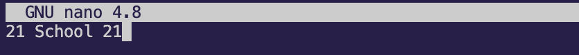
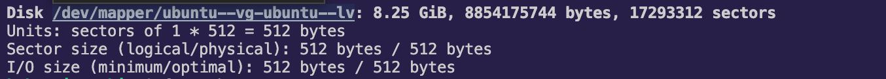
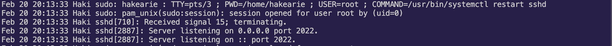

## Part 1. Установка ОС

1. Узнал версию ***Ubuntu***, выполнив команду `cat /etc/issue`.
2. Скриншот с выводом команды.

    

## Part 2. Создание пользователя

1. Скриншот команды для создания пользователя.
    
    

2. Добавил нового пользователя в группу `adm` через команду `sudo usermod -aG adm haki`
    
    

3. Тепреь при вызове команды `cat /etc/passwd` есть новый пользователь ***Haki***.
    
    
## Part 3. Настройка сети ОС

1. Через команду `sudo hostnamectl set-hostname` задал имя машины ***user-1***.
    
    

2. Установил временную зону, соответствующую текущему местоположению.
    
    

3. Вывел названия сетевых интерфейсов.
    
    

    - Интерфейс lo представляет собой сетевой интерфейс обратной петли (loopback). Он используется для соединения с тем же устройством, на котором он работает, обычно с IP-адресом 127.0.0.1
4. Через консольную команду получил ip-адрес устройства.
    
    

    - ***DHCP*** (Dynamic Host Configuration Protocol) — это протокол, который позволяет сетевым устройствам автоматически получать IP-адрес и другие параметры, необходимые для работы в сети TCP/IP3.
5. Определил и вывел на экран внешний ip-адрес шлюза (ip) и внутренний IP-адрес шлюза, он же ip-адрес по умолчанию (gw). 
    
    

6. Задал статические настройки ip, gw, dns.
     
    

7. После перезагрузки статичные сетевые настройки сохранились.
    
    

    - Получилось успешно пропинговать удаленные хосты ***1.1.1.1*** и ***ya.ru***.
    
    
    
    

## Part 4. Обновление ОС
1. Обновил системные пакеты до последней на момент выполнения задания версии. 
    
    

## Part 5. Использование команды **sudo**

1. Команда `sudo` (сокращение от “superuser do”) в системах Unix и Linux используется для выполнения команд с привилегиями суперпользователя (также известного как root-пользователь) из обычных учетных записей пользователей.
    
2. Разрешил новому пользователю созданному в [Part 2](#part-2-создание-пользователя), выполнять команду `sudo`
    - Через команду `sudo visudo`(специальная команда для безопасного редактирования файла sudoers).

    

3. Поменял hostname ОС от имени пользователя, созданного в пункте [Part 2](#part-2-создание-пользователя) (используя sudo). 

    

## Part 6. Установка и настройка службы времени
1. Через команду `timedatectl show` вывел время часового пояса, в котором сейчас нахожусь.
    
    

## Part 7. Установка и использование текстовых редакторов 

1. Для выхода с сохранением из ***vim*** использовал `:wq` 
    
    

2. Для выхода с сохранением из ***nano*** использовал `^X` потом `Y`
    
    

3. Для выхода с сохранением из ***mcedit*** использовал `F2` потом `F10` 
    
    

4. Для выхода из ***vim*** без сохранения использовал `:q!`
    
    

5. Для выхода из ***nano*** без сохранения использовал `^X` потом `N`
    
    

6. Для выхода из ***mcedit*** без сохранения использовал `F10` потом `No`
    
    
7. 
    - ***VIM*** - чтобы заменить слово, в режиме команды нужно прописать `:%s/старое_слово/новое_слово/g` и нажать `Enter`. Это заменит все вхождения старое_слово на новое_слово.
    
    
    
    
    
    - ***Nano*** - чтобы найти слово, используем `Control+W`, *"старое_слово"*, которое ищем, и нажмите `Enter`.
        - Чтобы заменить слово, используем `Control+\`, *"старое_слово"*, нажимаем `Enter`, затем *"новое_слово"* и снова `Enter`.
    
    
    
    
    
    - ***Mcedit*** - чтобы найти слово, нажимаем `F7`, *"старое_слово"*, которое ищем, и нажимаем `Enter`.
        - Чтобы заменить слово, `F4`, *"старое_слово"* в поле ***“Search for”***, *"новое_слово"* в поле ***“Replace with”***, и нажимаем `Enter`.
    
    
    
    

## Part 8. Установка и базовая настройка сервиса **SSHD**

1. Установил службу SSHd через команду `sudo apt install openssh-server`
    
    

2. Добавил автостарт службы при загрузке системы через команду `sudo apt install openssh-server`
    
    

3. Перенастрой службу SSHd на порт 2022 через команду `sudo vi /etc/ssh/sshd_config`
    
    

4. Команда `ps -ef | grep sshd]` отображает все процессы sshd, запущенные в системе. Каждая строка в выводе представляет один процесс sshd.
    - ***ps***: Это команда для отображения информации о процессах, запущенных в системе.
    - ***-ef***: Это ключи для команды ps
        * ***e*** означает “выбрать все процессы”.
        * ***f*** означает “полный формат вывода”, который включает в себя дополнительные детали, такие как ***UID*** *(идентификатор пользователя)*, ***PID*** *(идентификатор процесса)*, ***PPID*** *(идентификатор родительского процесса)*, время запуска процесса, ***TTY*** *(управляющий терминал)*, время ***CPU***, которое занял процесс, и команду, которая запустила процесс.
    - ***|***: Это символ конвейера, который используется для передачи вывода одной команды (в данном случае, ***ps -ef***) в качестве ввода для другой команды (в данном случае, ***grep sshd***).
    - grep: Это команда для поиска текста по шаблону. В данном случае, она ищет ***sshd***.
    - ***sshd***: Это шаблон, который grep ищет в выводе команды ***ps -ef***.
    
    

5. Перезагрузил систему через команду `sudo reboot`
    
    

    - Вывод команды netstat -tan содержит `tcp 0 0 0.0.0.0:2022 0.0.0.0:* LISTEN`
    
    

    - Объяснение ключей `-tan` в команде `netstat -tan`:
        * ***-t*** означает, что вы хотите видеть только TCP-соединения.
        * ***-a*** означает, что вы хотите видеть все соединения, включая те, которые в настоящее время слушают.
        * ***-n*** означает, что вы хотите видеть числовые адреса, а не пытаться разрешить имена хостов.
    - Объяснение столбцов вывода `netstat -tan`:
        * ***Proto***: Протокол соединения (***TCP*** или UDP).
        * ***Recv-Q и Send-Q***: Количество байт, не отправленных или не полученных.
        * ***Local Address***: Адрес и порт, на котором слушает служба.
        * ***Foreign Address***: Адрес и порт, к которым подключается служба.
        * ***State***: Состояние соединения (*LISTEN*, *ESTABLISHED* и т.д.).
    - Объяснение ***0.0.0.0*** в выводе `netstat -tan`:
        * ***0.0.0.0*** означает, что служба слушает на всех доступных интерфейсах, а не только на одном.

## Part 9. Установка и использование утилит **top**, **htop**

1. Выводы команды `top`:
    - Uptime
    
    

    - Кол-во авторизованных пользователей и общую загрузку системы
    
    
    
    - Общее количество процессов
    
    
   
   - Загрузку *cpu*
    
    
    
    - Загрузку памяти
    
    
    
    - *pid* процесса занимающего больше всего памяти
        * ***PID*** 1080
    
    
    
    - *pid* процесса, занимающего больше всего процессорного времени
        * ***PID*** 1134
    
    

2. Выводы команды htop:
    - Отсортировка по:  ***PID***, ***PERCENT_CPU***, ***PERCENT_MEM***, ***TIME*** используя `">"` или `F6`
        -  ***PID***

        

        - ***PERCENT_CPU***

        

        - ***PERCENT_MEM***

        

        - ***TIME***

        

    - Используя `F4` отфильтровал процессы для процесса ***sshd***
    
    

    - Используя поиск `F3` вывел процессы ***syslog***
    
    

    - Используя `F2` добавил вывод hostname, ***clock*** и ***uptime***  
    
    

## Part 10. Использование утилиты **fdisk**

1. C помощью команды `sudo fdisk -l` получил данные о дисках.
    
    

2. Через команду free -h вывел размер swap.
    
    

## Part 11.  Использование утилиты **df** 

1. Запустил команду `df`.
    
    

    - ***1K-blocks*** - это размер раздела.
    - ***Used*** - это размер занятого пространства.
    - ***Available*** - это размер свободного пространства.
    - ***Use%*** - это процент использования. Единица измерения в выводе - это ***1K-blocks***, что означает, что размеры указаны в блоках по 1024 байта.
    
    

2. Запустил командау `df -Th`.
    
    

    - ***Size*** - это размер раздела.
    - ***Used*** - это размер занятого пространства.
    - ***Avail*** - это размер свободного пространства.
    - ***Use%*** - это процент использования.
    - ***Type*** - это тип файловой системы для раздела.

    

## Part 12. Использование утилиты **du**

1.  Запустил команду `du`
    
    

2. Вывел размер папок через `du -sh`

    - ***/home***

    

    - ***/var***

    

    - ***/var/log***

    

3. Вывел размер всего содержимого в ***/var/log*** (не общее, а каждого вложенного элемента, используя *)

    

## Part 13. Установка и использование утилиты **ncdu**

1. Установил утилиту ncdu через `sudo apt install ncdu`
    
    

2. Вывел размер папка ***/home***
    
    

3. Вывел размер папка ***/var***
    
    

4.  Вывел размер папка ***/var/log***
    
    

## Part 14. Работа с системными журналами

1. Время последней успешной авторизации:
`Feb 20 19:28:33 Haki sshd[894]: Accepted password for hakearie from 10.0.2.2 port 62903 ssh2`
    

2. Перезагрузил службу ***SSHd*** через команду `sudo systemctl restart sshd`
    
    

3. Через `cat` нашел сообщение о рестарте службы в ***/var/log/auth.log***
    
    

4. Через `cat` нашел сообщение о рестарте службы в ***/var/log/syslog***
    
    

## Part 15. Использование планировщика заданий **CRON**

1. Через команду `crontab -e` для редавтирования списка заданий cron. Добавил команду следующую строку, чтобы запускать команду uptime каждые 2 минуты:
```
*/2 * * * * /usr/bin/uptime >> /home/hakearie/uptime.log
```
2. Cписок текущих задач для ***CRON***.
    
    

3. Отчет скрины со строчками о выполнении и списком текущих задач.
    
    

    - Через команду `crontab -l` вывел список текущих задач.
    
    
    
4. Удалил все задания из планировщика заданий через команду `cron -r`
    
    
  
